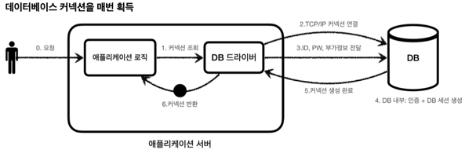
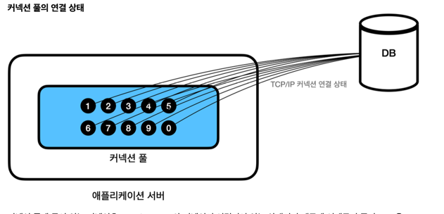

## 커넥션 풀
데이터베이스에서 커넥션을 획득할 때에는 다음과 같은 과정을 거치게 된다.

1. DB드라이버를 통해 커넥션을 조회한뒤, DB와 TCP/IP 커넥션을 연결하게 되고, 연결을 위한 네트워크 동작이 발생한다.

2. DB 드라이버는 DB의 ID와, PW와 같은 기타 부가정보를 DB에 전달한다.

3. ID와 PW로 내부 인증을 완료하고 DB 세션을 생헝한뒤, 커넥션 생성이 완료되었다는 응답을 보낸다.

4. 응답에 맞는 커넥션 객체를 생성해서 클라이언트에 반환된다.

애플리케이션 서버에서도 `TCP/IP` 커넥션을 새로 생성하기 위한 리소스를 매번 사용해야 한다.

진짜 문제는 고객이 애플리케이션을 사용할 때, SQL을 실행하는 시간 뿐만 아니라 커넥션을 새로 만드는 시간이 추가 되기 때문에 결과적으로 응답 속도에 영향을 준다. 이것은 사용자에게 좋지 않은 경험을 줄 수 있다.

이러한 문제를 한번에 해결하고자 하는 시도가 나왔고, 그것이 바로 커넥션을 미리 생성해두고 사용하자는 방식이다. 이것이 **커넥션 풀**이다.

애플리케이션을 시작하는 시점에 커넥션 풀은 필요한 만큼 커넥션을 미리 확보해서 풀에 보관한다. 보통 얼마나 보관할 지는 서비스의 특징과 스펙에 따라 다르지만 기본값은 10개이다.

커넥션 풀에 들어 있는 커넥션은 TCP/IP로 DB와 커넥션이 연결되어 있는 상태이기 때문에 언제든지 즉시 SQL을 DB에 전달할 수 있다.

이렇게 미리 연결해둔 커넥션 들을 풀에 모아두고, DB 드라이버를 통해 새로운 커넥션을 획득하는 방식이아닌, 커넥션 풀을 통해 이미 생성되어있는 커넥션을 참조하는 방식으로 그냥 가져다 쓰기만 하면된다.

그리고 다 사용된 커넥션은 사라지는 것이 아닌 다시 커넥션 풀에 **반환 하면 된다.**
커넥션을 종료하는 것이 아니라 커넥션이 살아있는 상 태로 커넥션 풀에 반환해야 한다는 것이다.

이러한 커넥션 풀을 이용하는 방식은 **빠른 응답 속도**를 보장하기 때문에 **실무에서는 항상 기본으로 사용되어지고 있다.**

성능과 사용의 편리함 측면에서 최근에는 `hikariCP` 를 주로 사용한다. 스프링 부트 2.0 부터는 기본 커넥션 풀 로 `hikariCP` 를 제공한다.