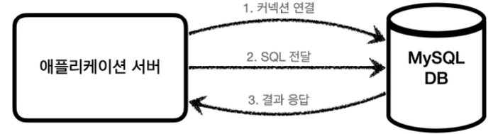
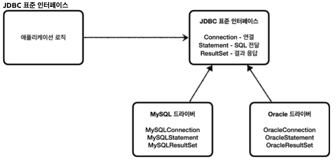
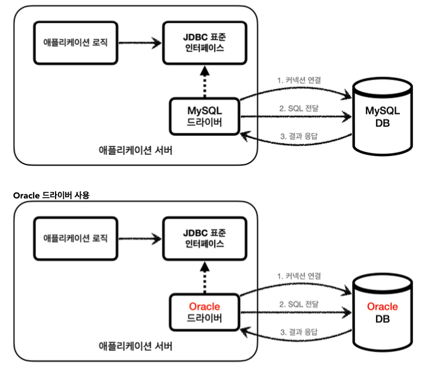

#### JDBC의 등장

애플리케이션 개발 시에 중요한 데이터는 대부분 DB에 보관하게 되어있다.

클라이언트가 애플리에키션 서버를 통해 데이터를 저장 및 조회 시 애플리케이션 서버는 DB를 통해 해당 기능을 수행하게 된다.

1. **커넥션 연결**: 주로 TCP/IP를 사용해서 커넥션을 연결한다.
2. **SQL 전달**: 애플리케이션 서버는 DB가 이해할 수 있는 SQL을 연결된 커넥션을 통해 DB에 전달한다.
3. **결과 응답**: DB는 전달된 SQL을 수행하고 그 결과를 응답한다. 애플리케이션 서버는 응답 결과를 활용한다.

문제는 각각의 데이터베이스마다 커넥션을 연결하는 방법과 SQL을 전달하는 방법이 다 달랐었다.

**해당 부분에는 크게 2가지의 문제가 존재하게 된다.**

- 데이터베이스를 다른 종류의 **DB로 변경**할 경우 서버에 개발된 **DB 사용 코드 또한 함께 변경되어야 한다.**
- **개발자가 각각의 DB마다** 커넥션 연결 및 SQL 전달, 그리고 해당 결과를 응답 받는 방법을 새**로 학습해야한다.**

이런 문제를 해결하기 위해 JDBC라는 자바 표준이 등장한다.

**JDBC 표준 인터페이스**

JDBC(Java Database Connectivity)는 **자바에서 데이터베이스에 접속할 수 있도록 하는 자바 API다.****

**JDBC는 데이터베이스에서 자료를 쿼리하거나 업데이트하는 방법을 제공한다. - 위키백과**

JDBC는 위의 이미지에서 보다시피 3가지의 기능을 제공한다.
**Connection(DB연결), Statement(SQL 전달), ResultSet(결과응답)**

그런데 인터페이스만 있다고해서 기능이 동작하지는 않는다. JDBC 인터페이스를 통해 각각의 DB회사에서 자신의 DB에 맞도록 구현해서 라이브러리로 제공하는데 이것을 **JDBC드라이버**라 한다.

예를 들어서 MySQL DB에 접근 할 수 있는 것은 MySQL JDBC 드라이버라 하고, Oracle DB에 접근할 수 있는 것은 Oracle JDBC 드라이버라 한다.

**정리**
JDBC의 등장으로 위에서 언급했던 큰 2가지의 문제가 해결되었다.

- DB 변경 시 사용 코드도 함께 변경되어야 하는 문제
    - DB를 다른 종류의 DB로 변경 시 JDBC 구현 라이브러리만 변경하면 된다. 따라서 사용 코드는 그대로 유지할 수 있다는 것.
- DB 변경 시 해당 DB의 사용법을 학습해야 하는 문제
    - 개발자는 단순 자바가 지원하는 JDBC 표준 인터페이스의 사용법만 알고 있으면 된다.