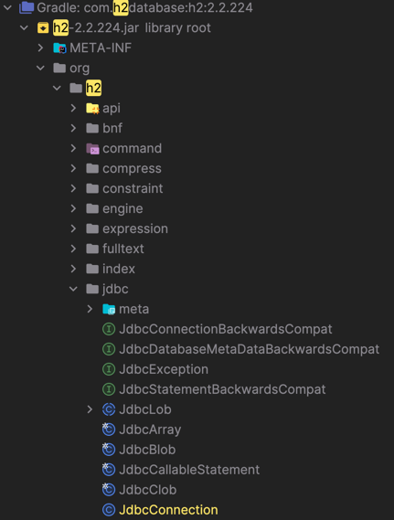

## JDBC 연결 과정

JDBC를 이용해서 실제 데이터베이스와 연결을 시도해보도록 하겠다.

자바와 데이터베이스를 연결하려면 JDBC가 제공하는`DriverManager.getConnection`를 사용하면 된다.

이렇게 하면 라이브러리에 있는 데이터베이스 드라이버를 찾아서 해당 드라이버가 제공하는 커넥션을 반환해준다.


```java
public abstract class ConnectionConst {  
    public static final String URL = "jdbc:h2:tcp://localhost/~/test";  
    public static final String USER = "sa";  
    public  static final String PASSWORD = "";  
}

@Slf4j  
public class DBConnectionUtil {  
    public static Connection getConnection() {  
        try {  
            Connection connection = DriverManager.getConnection(URL, USER, PASSWORD);  
            log.info("getConnection = {}, class = {}", connection, connection.getClass());  
            return connection;  
        } catch (SQLException e) {  
            throw new RuntimeException(e);  
        }  
    }  
}
```

```java
Connection connection = DriverManager.getConnection(URL, USER, PASSWORD);  
```

해당 부분에서 getConnection을 통해 필요한 URL과 USER, PASSWORD를 인자로 전달해주면 해당 드라이버가 제공하는 커넥션을 받을 수 있다.

이를 테스트 코드로 작성해서 실제 연결이 되는지를 알아보자

```java
  
    @Test  
    void connection() {  
        Connection connection = DBConnectionUtil.getConnection();  
        Assertions.assertThat(connection).isNotNull();  
        // 여기까지 Connection을 통해서 JDBC 드라이버를 꺼내왔다. 현재 프로젝트에선 h2 드라이버를 꺼내온 것.  
    }  
}
```

**실행결과**
```console
 DBConnectionUtil - get connection=conn0: url=jdbc:h2:tcp://localhost/~/test
 
 user=SA, class=class org.h2.jdbc.JdbcConnection
```
실행 결과를 보면 class=class org.h2.jdbc.JdbcConnection 해당 부분을 확인할 수 있다.

해당 부분이 H2드라이버가 제공하는 H2전용 커넥션이다.

그리고 해당 커넥션은 JDBC 표준 커넥션 인터페이스인 `java.sql.Connection`를 구현하고 있다.

- JDBC는 `java.sql.Connection` 표준 커넥션 인터페이스를 정의한다.
- H2 데이터베이스 드라이버는 JDBC Connection 인터페이스를 구현한 org.h2.jdbc.JdbcConnection 구현체를 제공한다.


#### DriverManger
JDBC가 제공하는 DriverManger는 라이브러리에 등록된 DB 드라이버들을 관리하고, 커넥션을 획득하는 기능을 제공한다.

라이브러리에 등록된 드라이버 목록을 자동으로 인식하여, 해당 드라이버들에게 순서대로 다음 정보를 넘겨서 커넥션을 획득할 수 있는지 확인하는 것이다.

여기서 각각의 드라이버는 URL 정보를 체크해서 본인이 처리할 수 있는 요청인지 확인한다.

예를 들어서 URL이 `jdbc:h2` 로 시작하면 이것은 h2 데이터베이스에 접근하기 위한 규칙이다.

따라서 H2 드라이버는 본인이 처리할 수 있으므로 실제 데이터베이스에 연결해서 커넥션을 획득하고 이 커넥션을 클라이언트에 반환한다.

반면에 URL이 `jdbc:h2` 로 시작했는데 MySQL 드라이버가 먼저 실행되면 이 경우 본인이 처리 할 수 없다는 결과를 반환하게 되고, 다음 드라이버에게 순서가 넘어간다.



해당 부분이 의존성 추가로 받았던 H2 드라이버이다. 보면 JdbcConnection이 있는 것을 알 수 있다.

**JdbcConnection이 제공하는 기능들...**

```java
public Statement createStatement() throws SQLException {
        try {
            int var1 = getNextId(8);
            this.debugCodeAssign("Statement", 8, var1, "createStatement()");
            this.checkClosed();
            return new JdbcStatement(this, var1, 1003, 1007);
        } catch (Exception var2) {
            throw this.logAndConvert(var2);
        }
    }

    public Statement createStatement(int var1, int var2) throws SQLException {
        try {
            int var3 = getNextId(8);
            if (this.isDebugEnabled()) {
                this.debugCodeAssign("Statement", 8, var3, "createStatement(" + var1 + ", " + var2 + ')');
            }

            checkTypeConcurrency(var1, var2);
            this.checkClosed();
            return new JdbcStatement(this, var3, var1, var2);
        } catch (Exception var4) {
            throw this.logAndConvert(var4);
        }
    }

```